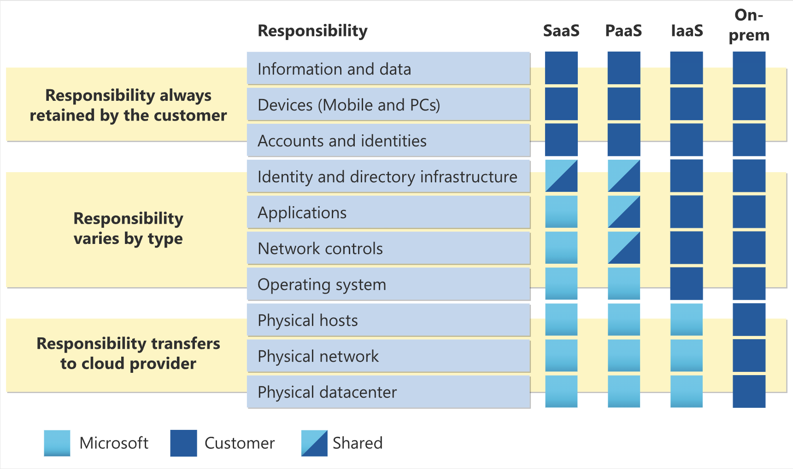

# Describe cloud computing

1. what is cloud computing?

Cloud computing is the delivery of computing services over the internet.

When we say computing services, it refers to some computing power and resources, which can provide user run their applications, storing data and processing tasks without local hardware. We can also understand computing services as IT infrastructures such as virtual machines, storage, databases, and networking.

Cloud services also expand the traditional IT offerings to include things like Internet of Things (IoT), machine learning (ML), and artificial intelligence (AI)

1. shared responsibility model
- traditional corporate datacenter(on-premises): company itself need to be responsible for everything, include maintaining the physical space, ensuring security, and all the infrastructure and software needed to keep the datacenter running.
- cloud computing is built on the shared responsibility model. With the shared responsibility model, these responsibilities get shared between the cloud provider and the consumer.
    - cloud provider always responsible for the physical datacenter, the physical network, the physical hosts
    - consumer( maybe individual user of company) will always responsible for the information and data stored in the cloud, devices that are allowed to connect to your cloud (cell phones, computers, and so on), the accounts and identities of the people, services, and devices within your organization
    - other responsibilities such as Operating systems, Network controls, Applications, Identity and infrastructure depends on the cloud service model: infrastructure as a service (IaaS), platform as a service (PaaS), and software as a service (SaaS).
    
    
    
1. cloud models

The cloud models define the deployment type of cloud resources. The three main cloud models are: private, public, and hybrid.

- private cloud: a cloud (delivering IT services over the internet) that’s used by a single entity. Could be hosted from datacenter on-site or off-site.
- public cloud: built, controlled, and maintained by a third-party cloud provider. With a public cloud, anyone that wants to purchase cloud services can access and use resources.
- hybrid cloud:  a computing environment that uses both public and private clouds in an inter-connected environment. Users can flexibly choose which services to keep in public cloud and which to deploy to their private cloud infrastructure.
1. consumption-based model

When comparing IT infrastructure models, there are two types of expenses to consider. Capital expenditure (CapEx) and operational expenditure (OpEx).

Cloud computing operates on an **operational expenditure (OpEx)** model, where users pay for resources based on consumption, avoiding the upfront costs and long-term commitments of **capital expenditure (CapEx)**. 

This model eliminates the need to purchase and maintain physical infrastructure, providing flexibility to scale resources up or down as needed. It reduces waste from overprovisioning and the risks of underprovisioning associated with traditional datacenters, ensuring cost efficiency and adaptability to changing demands.

Cloud computing is the delivery of computing services over the internet by using a pay-as-you-go pricing model.